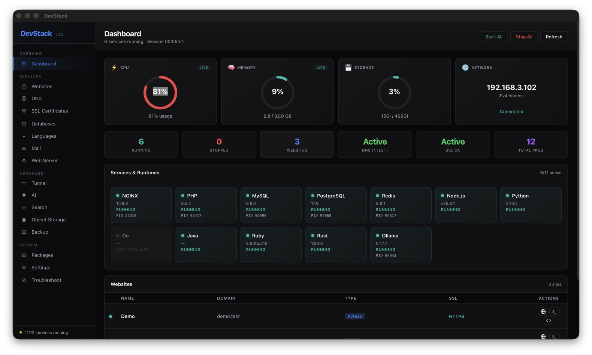

<p align="center">
  
</p>

<h1 align="center">DevStack</h1>

<p align="center">
  <strong>Your local development environment, managed.</strong><br>
  A native macOS desktop app for managing nginx, PHP, databases, DNS, SSL, tunnels, and more — all from one place.
</p>

<p align="center">
  
  
  
  
  
</p>

---

## Screenshots

### Dashboard
Monitor all services, system resources, and websites at a glance.



<!-- Add more screenshots as you capture them:
### Websites


### Databases


### Tunnel


### Settings (Light Theme)

-->

---

## Features

### Services & Infrastructure

<table>
<tr>
<td width="50%">

#### Dashboard
- Live CPU, memory, disk, and network stats
- All services at a glance with version + PID
- Quick Start All / Stop All controls
- Session uptime counter
- Website list with quick actions (open, terminal, editor)

</td>
<td width="50%">

#### Websites
- Create sites in one click: PHP, Node.js, Python, Static, WordPress
- Auto-generates nginx config, SSL cert, and DNS entry
- Custom document root, PHP version per site
- Access/error log viewer per site
- Open in browser, terminal, or code editor

</td>
</tr>
<tr>
<td>

#### Web Server (nginx)
- Start, stop, restart, reload nginx
- Edit nginx config directly in-app
- Auto-tail access and error logs
- Rewrite rule templates (WordPress, Laravel, etc.)

</td>
<td>

#### Databases
- **MySQL** and **PostgreSQL** support
- Create, drop, import (`.sql`), and export databases
- Edit `my.cnf` / `postgresql.conf` in-app
- View connection details (host, port, socket)

</td>
</tr>
<tr>
<td>

#### Languages & Runtimes
- **PHP** — Multiple versions, one-click switching
- **Node.js** — Version management
- **Python** — Version management
- **Go, Ruby, Java** — Install and manage
- Active version shown per runtime

</td>
<td>

#### DNS
- Local DNS via **dnsmasq** (`.test` domains)
- Click-to-install if not present
- `/etc/hosts` editor — add, remove, edit entries
- Custom TLD support
- One-click DNS setup and reconfigure

</td>
</tr>
</table>

### Security & Networking

<table>
<tr>
<td width="50%">

#### SSL Certificates
- Auto-generate trusted local certs via **mkcert**
- Wildcard certificate support
- Install local CA with one click
- Manage and delete certificates

</td>
<td width="50%">

#### Tunnels
- **Cloudflare Tunnel** — Free, no account needed
- **ngrok** — Full tunnel support
- Click-to-install providers (no manual brew commands)
- Copy public URL, open in browser
- Auto-detects tunnel URL from logs

</td>
</tr>
</table>

### Advanced Tools

<table>
<tr>
<td width="33%">

#### AI (Ollama)
- Pull and manage LLM models
- Start/stop Ollama service
- Click-to-install
- Model list with sizes

</td>
<td width="33%">

#### Mail (Mailpit)
- Local mail server
- Click-to-install
- Start/stop with one click
- Catch all outgoing mail

</td>
<td width="33%">

#### Search (Meilisearch)
- Full-text search engine
- Click-to-install
- Start/stop service
- Lightning fast indexing

</td>
</tr>
<tr>
<td>

#### Object Storage (MinIO)
- S3-compatible storage
- Click-to-install
- Start/stop service
- Local development storage

</td>
<td>

#### Backup & Restore
- Backup sites and databases
- Scheduled backups
- One-click restore
- Manage backup history

</td>
<td>

#### Packages
- Full Homebrew package list
- Install, upgrade, uninstall
- Check for updates
- Upgrade all at once

</td>
</tr>
</table>

### App Experience

<table>
<tr>
<td width="50%">

#### Settings
- **Dark / Light / Auto** theme
- Launch at login toggle
- Custom domain suffix (`.test`, `.local`, etc.)
- Auto-start services on launch
- Persistent preferences

</td>
<td width="50%">

#### System
- **Onboarding Wizard** — First-run guided setup
- **Troubleshoot** — Diagnostics for nginx, PHP, MySQL, ports, DNS, CA, disk
- **System Tray** — Quick access from menu bar
- **Toast Notifications** — Feedback on every action

</td>
</tr>
</table>

---

## Requirements

- **macOS** (Apple Silicon or Intel)
- **Homebrew** — DevStack uses Homebrew to install and manage all services

> DevStack will guide you through installing everything else via the built-in **Onboarding Wizard**.

---

## Getting Started

### Option 1: Download the DMG

Grab the latest `.dmg` from [Releases](https://github.com/hamza-younas94/devStack/releases), open it, and drag DevStack to Applications.

### Option 2: Build from Source

**Prerequisites:**
- [Node.js](https://nodejs.org/) (v18+)
- [Rust](https://rustup.rs/) (1.77+)
- [Homebrew](https://brew.sh/)

```bash
# Clone the repo
git clone git@github.com:hamza-younas94/devStack.git
cd devStack

# Install dependencies
npm install

# Run in development mode
npm run tauri dev

# Build for production
npm run tauri build
```

The built app will be at:
```
src-tauri/target/release/bundle/macos/DevStack.app
src-tauri/target/release/bundle/dmg/DevStack_0.1.0_aarch64.dmg
```

---

## First Run

When you launch DevStack for the first time, the **Onboarding Wizard** checks your system and walks you through setup:

| Step | What it does |
|------|-------------|
| **Create Dirs** | Creates `~/.devstack` directory structure |
| **Install Essentials** | Installs nginx, PHP, MySQL, Node.js, Redis via Homebrew |
| **Setup SSL CA** | Installs a local Certificate Authority via mkcert |
| **Setup DNS** | Configures dnsmasq for `.test` domains |
| **Start Services** | Starts all installed services |

You can run each step individually or skip and set up later.

---

## Usage

### Create a Website

```
Websites → Create Site → name: myapp, type: PHP → Create
```

DevStack automatically:
- Creates `~/.devstack/sites/myapp/`
- Generates nginx config with SSL
- Creates a trusted SSL certificate via mkcert
- Configures DNS → `myapp.test`

Visit **https://myapp.test** in your browser.

### Expose via Tunnel

```
Tunnel → Install Cloudflare (one click) → Port: 443 → Create Tunnel → Copy URL
```

Share the public URL with anyone — they can access your local site.

### Manage Databases

```
Databases → MySQL → Create Database → name: myapp_db
```

Import `.sql` files, export backups, edit configs — all in the GUI.

### Switch PHP Version

```
Languages → PHP → Click desired version → nginx reloads automatically
```

---

## Tech Stack

| Layer | Technology |
|-------|-----------|
| **Framework** | [Tauri v2](https://v2.tauri.app/) (native, lightweight) |
| **Frontend** | React 19, TypeScript 5.9, Vite 8 |
| **Backend** | Rust 2021 edition |
| **Package Manager** | Homebrew |
| **Styling** | Custom CSS (dark + light theme, no framework) |

---

## Project Structure

```
devstack-app/
├── src/                        # React frontend
│   ├── App.tsx                 # Layout, sidebar, routing, onboarding
│   ├── main.tsx                # Entry point
│   ├── ToastContext.tsx         # Global toast notifications
│   ├── styles.css              # All styles (1400+ lines, dark + light)
│   └── components/
│       ├── Dashboard.tsx        # System overview, service grid
│       ├── Websites.tsx         # Site CRUD, logs, config
│       ├── WebServer.tsx        # nginx control, log tailing
│       ├── Databases.tsx        # MySQL/PostgreSQL management
│       ├── Languages.tsx        # Runtime version management
│       ├── DNS.tsx              # dnsmasq + /etc/hosts
│       ├── SSL.tsx              # mkcert certificates
│       ├── Tunnel.tsx           # Cloudflare/ngrok tunnels
│       ├── AI.tsx               # Ollama models
│       ├── Mail.tsx             # Mailpit service
│       ├── Search.tsx           # Meilisearch service
│       ├── ObjectStorage.tsx    # MinIO service
│       ├── Packages.tsx         # Homebrew package management
│       ├── Backup.tsx           # Backup/restore
│       ├── Settings.tsx         # App preferences
│       └── Troubleshoot.tsx     # System diagnostics
├── src-tauri/                   # Rust backend
│   ├── src/
│   │   ├── lib.rs              # 65+ Tauri commands (~1600 lines)
│   │   └── main.rs             # App entry
│   ├── Cargo.toml
│   └── tauri.conf.json
├── screenshots/                 # App screenshots
├── package.json
├── tsconfig.json
└── vite.config.ts
```

---

## Supported Services

| Service | Formula | Purpose |
|---------|---------|---------|
| nginx | `nginx` | Web server / reverse proxy |
| PHP | `php` | PHP-FPM (multi-version) |
| MySQL | `mysql` | Relational database |
| PostgreSQL | `postgresql@17` | Relational database |
| Redis | `redis` | In-memory cache / store |
| Node.js | `node` | JavaScript runtime |
| Python | `python` | Python runtime |
| Go | `go` | Go runtime |
| dnsmasq | `dnsmasq` | Local DNS server |
| mkcert | `mkcert` | Trusted local SSL certs |
| Mailpit | `mailpit` | Local mail catch-all |
| Meilisearch | `meilisearch` | Search engine |
| MinIO | `minio` | S3-compatible storage |
| Ollama | `ollama` | Local AI / LLMs |
| Cloudflare Tunnel | `cloudflare/cloudflare/cloudflared` | Public tunnels |
| ngrok | `ngrok/ngrok/ngrok` | Public tunnels |

---

## Contributing

1. Fork the repo
2. Create a branch: `git checkout -b feature/my-feature`
3. Make your changes
4. Build and test: `npm run tauri build`
5. Commit and push
6. Open a Pull Request

### Adding a New Service

1. **Backend** — Add Tauri commands in `src-tauri/src/lib.rs` and register in `invoke_handler`
2. **Frontend** — Create `src/components/YourService.tsx`, use `invoke()` to call commands
3. **Sidebar** — Add menu item in `src/App.tsx`
4. **Styles** — Reuse existing card/table/button classes from `src/styles.css`

---

## Roadmap

- [ ] Linux support (apt/dnf package manager backend)
- [ ] Windows support (choco/winget/scoop backend)
- [ ] Docker container management
- [ ] MongoDB support
- [ ] Queue management (Redis queues, RabbitMQ)
- [ ] Cron job management
- [ ] Multiple PHP-FPM pools per site
- [ ] Site templates (Laravel, Next.js, Django, etc.)
- [ ] Auto-update mechanism

---

## License

MIT — see [LICENSE](LICENSE) for details.

---

<p align="center">
  Built with Tauri, React, and Rust<br>
  <sub>Made by <a href="https://github.com/hamza-younas94">Hamza Younas</a></sub>
</p>
